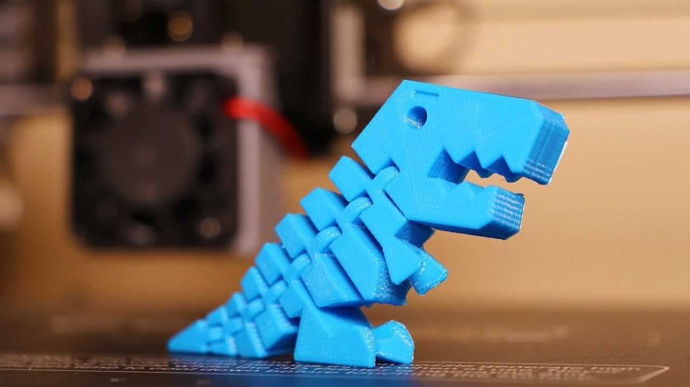
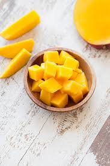

# Joshua Lee ABOUT ME🥶😜🥶😜🥶
## 1. Volunteer Work 
### This summer, I worked inside of a local church to create a 5-day entrepreneurial camp for elementary through middle school students. I led a small group of around 7 kids with a partner, assisting them through the activites, promoting participation, and engaging positive thinking and collaboration. Alongside with leading a small group, I also was an advisor for the 3d-printing station. Each kid had their own business specialty, which would create products to sell on friday night in an event called the marketplace. Our group 3d-printed keychains and flexi-dinos to sell on the marketplace. I also helped the students and assisted them in designing their own nametag.

## 2. Tech Projects & Experiments
### This last Christmas, I got a 3d printer, so I took the time this summer to print models that would be practical around the household, or just fun. Examples include a watch stand for my dad, a phone stand, and a couple fidget toys. I wanted to learn how to make intricate models but I did not get very far when I tried to learn 3d-modeling, but I will still try in my free time. 

### I also made a website for the school magnet. I am apart of the GSTEAM council and we are currently working on a project that aims to engage the students(kinda secret right now). I made a website using weebly and as of right now, we do not have much media and html but I created a wireframe made up of 3 pages and am still working on it daily.

## 3. Athletics
### Coming into the summer, my main goal was to get better at my sport, volleyball. I took it upon myself to use weights and training to get stronger and quicker and used youtube videos to study film and get knowledgable. A memory I made was being in my empty garage just doing weighted jumping exercises; I did this consistently for a couple weeks and it was the most tiring and mentally straining thing Ive done in a while; however, it was worth it, as I got a lot stronger and am jumping a lot higher. I also played a lot of volleyball, either just games for fun with friends or lessons from the local club Socal Legends.

## 4. Summer Playlist
### So this summer, I didn't listen to as much music as I have before; however, I did listen to a few songs including:

- ### Dreams and Nightmares - Meek Mill
- ### DNA. - Kendrick Lamar
- ### Not Like Us - Kendrick Lamar
- ### Euphoria - Kendrick Lamar
- ### A lot of Metro Boomin songs

### and I started listening to a lot of old 80s hits, like

- ### In the Air Tonight - Phil Collins
- ### A LOT of Guns N Roses, like Welcome to the Jungle
- ### ACDC music
- ### songs by Queen

## 5. Favorite Summer Food
### This summer I ate a lot of good food; I am now happy to announce that my favorite food is grilled chicken and Salmon. I also ate this amazing steak at a wedding and it just opened my eyes to how food can be art. In addition, frozen mangos were a favorite among me and my sister; my mom randomly bought a bag from a Smart and Final, and ever since we have been eating them like every other day. We already loved mangos, but eating them frozen just upped their level; especially when my sister started to blend them to create a sorbet.
